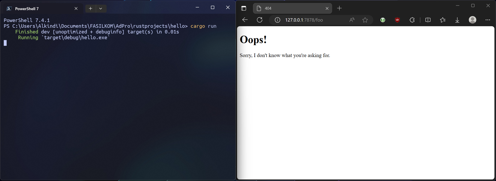

# Multithreaded Rust Web-Server (Concurrency)

## Commit 1

Dibuat fungsi `handle_connection` untuk membaca isi dari TcpStream yang didapatkan dari listener yang memonitor address `127.0.0.1:7878`.
Didalamnya, digunakan `buf_reader` untuk membaca TcpStream tersebut dengan efisien (karena menggunakan buffering).

Selanjutnya, tiap baris dari `buf_reader` dibaca dan diunwrap menjadi String.
Ini berlangsung hingga `buf_reader` menemukan baris kosong, kemudian String yang sudah didapatkan dikumpulkan ke vector `http_request` menggunakan `collect()`.

Terakhir, isi dari `http_request` diprint menggunakan `println!`.

## Commit 2

Fungsi `handle_connection` dimodifikasi untuk menampilkan file html.

Variabel `status_line` menandakan status dari request yang terjadi (untuk case ini, diisi '200 OK').
Variabel `contents` diisi dengan hasil baca file `hello.html` yang telah diunwrap menjadi String.
Variabel `length` menandakan panjang dari `contents`.

Ketiga variabel tersebut membentuk String `response` yang kemudian dikirim kembali ke client melalui TcpStream yang sama. Client akan menerima response tersebut dan menampilkan `hello.html` (apabila diakses lewat browser).


## Commit 3

Sebelumnya, program akan selalu mengembalikan response yang sama untuk semua request dari client. Di tahap ini, fungsi `handle_connection` dimodifikasi lagi untuk memberikan response yang berbeda apabila request dari path yang tidak sesuai (misal: `127.0.0.1:7878/bad`)

Pertama, fungsi `handle_connection` diubah sehingga menjadi seperti berikut:

```rust
let buf_reader = BufReader::new(&mut stream);
    let request_line = buf_reader.lines().next().unwrap().unwrap();

    if request_line == "GET / HTTP/1.1" {
        let status_line = "HTTP/1.1 200 OK";
        let contents = fs::read_to_string("hello.html").unwrap();
        let length = contents.len();

        let response = format!(
            "{status_line}\r\nContent-Length: {length}\r\n\r\n{contents}"
        );

        stream.write_all(response.as_bytes()).unwrap();
    } else {
        let status_line = "HTTP/1.1 404 NOT FOUND";
        let contents = fs::read_to_string("404.html").unwrap();
        let length = contents.len();

        let response = format!(
            "{status_line}\r\nContent-Length: {length}\r\n\r\n{contents}"
        );

        stream.write_all(response.as_bytes()).unwrap();
    }
```

Variabel `http_request` dihapus, dan dibuat variabel `request_line` yang berisi hasil baca baris pertama dari HTTP request.
Ini diperlukan untuk membaca tipe (`GET`/`POST`/etc...) dan *path* dari request yang diterima.

Terlihat bahwa `response` dibagi menjadi dua branch. Apabila request yang terjadi merupakan `GET` dan addressnya `/`, maka response akan berisi status kode '200 OK' dengan konten file `hello.html`. Untuk request lainnya, response yang dikembalikan akan berisi status kode '404 NOT FOUND' dengan konten file `404.html`.

Akan tetapi, fungsi `handle_connection` masih perlu untuk direfactor. Ini dikarenakan kode tersebut melanggar clean code DRY (*Don't Repeat Yourself*).
Di kedua branching yang terjadi, kode yang ditulis mirip satu sama lain kecuali untuk bagian penetapan variabel `status_line` dan nama file yang dibaca untuk `contents`. Kode hasil refactor terlihat seperti berikut:

```rust
let (status_line, filename) = if request_line == "GET / HTTP/1.1" {
    ("HTTP/1.1 200 OK", "hello.html")
} else {
    ("HTTP/1.1 404 NOT FOUND", "404.html")
};

let contents = fs::read_to_string(filename).unwrap();
let length = contents.len();

let response =
    format!("{status_line}\r\nContent-Length: {length}\r\n\r\n{contents}");

stream.write_all(response.as_bytes()).unwrap();
```

Terlihat bahwa block if-else diubah untuk hanya menetapkan isi dari `status_line` dan `filename` saja.
Variabel `contents` menggunakan isi dari `filename` untuk memilih file yang akan dibaca menjadi String.
Sisa dari kode yang sebelumnya duplikat sudah tidak duplikat lagi.

Kode hasil refactor lebih mudah dibaca dan akan lebih mudah untuk dimodifikasi apabila ingin menambahkan response baru lainnya.


