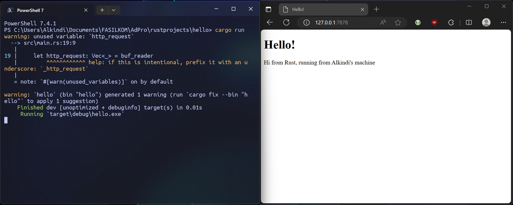

# Multithreaded Rust Web-Server (Concurrency)

## Commit 1

Dibuat fungsi `handle_connection` untuk membaca isi dari TcpStream yang didapatkan dari listener yang memonitor address `127.0.0.1:7878`.
Didalamnya, digunakan `buf_reader` untuk membaca TcpStream tersebut dengan efisien (karena menggunakan buffering).

Selanjutnya, tiap baris dari `buf_reader` dibaca dan diunwrap menjadi String.
Ini berlangsung hingga `buf_reader` menemukan baris kosong, kemudian String yang sudah didapatkan dikumpulkan ke vector `http_request` menggunakan `collect()`.

Terakhir, isi dari `http_request` diprint menggunakan `println!`.

## Commit 2

Fungsi `handle_connection` dimodifikasi untuk menampilkan file html.

Variabel `status_line` menandakan status dari request yang terjadi (untuk case ini, diisi '200 OK').
Variabel `contents` diisi dengan hasil baca file `hello.html` yang telah diunwrap menjadi String.
Variabel `length` menandakan panjang dari `contents`.

Ketiga variabel tersebut membentuk String `response` yang kemudian dikirim kembali ke client melalui TcpStream yang sama. Client akan menerima response tersebut dan menampilkan `hello.html` (apabila diakses lewat browser).

